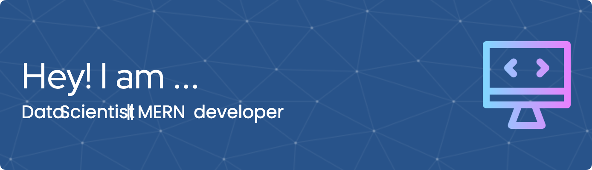

<!---
X-sena-X/X-sena-X is a ✨ special ✨ repository because its `README.md` (this file) appears on your GitHub profile.
You can click the Preview link to take a look at your changes.
--->
<!---
/**
 Hi My name is Sena Abhishek
          
=====================================================================================================================================

Full Stack Developer  UI developer
---------------------------------

I'm learning webDeveloping for past 2 years. I'am looking forward to work on projects.

### Skills

### Socials

    

### Badges

<b>My GitHub Stats</b>

<h1 align="center">Hi 👋, I'm Sena abhishek</h1>
<h3 align="center">An enthusiastic ML Engineer and a passionate web developer</h3>

-->
<!--
- 🌱 I’m currently learning **Next Js and CNN**

- 💬 Ask me about **ReactJs,Neural Network**

- 📫 How to reach me **creatorsenaabhishek@gmail.com**

<h3 align="left">Connect with me:</h3>

   

<h3 align='right'>Buy me a coffee <a href="https://www.buymeacoffee.com/sena007"</h3>
<h3 align="left">Skills:</h3>

                             

&nbsp;

-->

<!---
X-sena-X/X-sena-X is a ✨ special ✨ repository because its `README.md` (this file) appears on your GitHub profile.
You can click the Preview link to take a look at your changes.

--->

<h1 align="center">Hi 👋, I'm Sena abhishek</h1>
<h1 align="center">🔥 Doctor Strange by day, AI tamer by night 🤖 </h1>

<!--

-->

<h1>🚀 About me</h1>

👨‍💻 An aspiring CS undergrad looking to turn world insideout.  ⚡️ Turning caffeine into code and dreams into data.  
💬 If you can't find me, I'm probably lost in a neural network or debugging in another dimension. 
⛑️ Secret weapon: Turning "It's not a bug" into "It's an undocumented feature" 

<!-- <h3 align='right'>Buy me a coffee <a href="https://www.buymeacoffee.com/sena007"</h3> -->

 
  
  
 

<table>
  <tr>
    <td>
      
    </td>
    <td>
      
    </td>
    
  </tr>
</table>

<h1 align="center"> BLOCKBUSTERS </h1>

 Warning: My repos may contain traces of world-changing algorithms  

  <table>
    <tr>
      <td>
        
      </td>
      <td>
        
      </td>
    </tr>
    <tr>
      <td>
        
      </td>
      <td>
        
      </td>
    </tr>
  </table>

<h1 align="center">💼 TECH STACK</h1>

    <h3 align="center">Web Development</h3>

<table style="background-color: black; color: white; border: none; border-radius: 15px; overflow: hidden;">
  <thead>
    <tr align="center">
      <th colspan="8" align="center" style="color: white;">Frontend</th>
    </tr>
  </thead>
  <tbody>
    <tr>
      <td align="center" style="border: none;">
        
         Next.js
      </td>
      <td align="center" style="border: none;">
        
         Tailwind CSS
      </td>
      <td align="center" style="border: none;">
        
         React
      </td>
      <td align="center" style="border: none;">
        
         TypeScript
      </td>
      <td align="center" style="border: none;">
        
         JavaScript
      </td>
    </tr>
  </tbody>
</table>

<table style="background-color: black; color: white; border: none; border-radius: 15px; overflow: hidden;">
  <thead>
    <tr>
      <th colspan="5" align="center" style="color: white;">Backend</th>
    </tr>
  </thead>
  <tbody>
    <tr>
      <td align="center" style="border: none;">
         Node.js
      </td>
      <td align="center" style="border: none;">
         Django
      </td>
      <td align="center" style="border: none;">
         Flask
      </td>
      <td align="center" style="border: none;">
         Express
      </td>
      <td align="center" style="border: none;">
         FastAPI
      </td>
    </tr>
  </tbody>
</table>

<table style="background-color: black; color: white; border: none; border-radius: 15px; overflow: hidden;">
  <thead>
    <tr>
      <th colspan="4" align="center" style="color: white;">ORM</th>
    </tr>
  </thead>
  <tbody>
    <tr>
      <td align="center" style="border: none;">
         Prisma
      </td>
    </tr>
  </tbody>
</table>

    <h3 align="center">Cloud Computing & DevOps</h3>
    

        <table style="background-color: black; color: white; border: none; border-radius: 15px; overflow: hidden;">
            <thead>
                <tr>
                    <th colspan="2" align="center" style="color: white;">
                        Containerization & Orchestration
                    </th>
                </tr>
            </thead>
            <tbody>
                <tr>
                    <td align="center" style="border: none;">
                        
                          Docker
                    </td>
                    <td align="center" style="border: none;">
                        
                          Kubernetes
                    </td>
                </tr>
            </tbody>
        </table>
    

